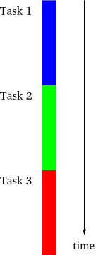
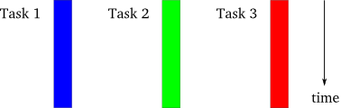
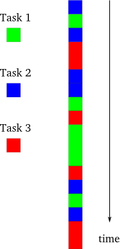
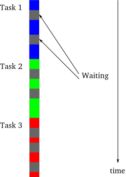

### 前言

最近有人在Twisted邮件列表中提出诸如"为任务紧急的人提供一份Twisted介绍"的需求。值得提前透露的是，这个系列并不会如他们所愿。尤其是介绍Twisted框架和基于Python 的异步编程而言，可能短时间无法讲清楚。因此,如果你时间紧急，这恐怕不是你想找的资料。

我相信如果对异步编程模型一无所知，快速的介绍同样无法让你对其有所理解，至少你得稍微懂点基础知识吧。我已经用Twisted框架几年了，因此思考过我当初是怎么学习它(学得很慢)并发现学习它的最大难度并不在Twisted本身,而在于对其模型的理解，只有理解了这个模型，你才能更好去写和理解异步程序的代码。大部分Twisted的代码写得很清晰，其在线文档也非常棒（至少在开源软件这个层次上可以这么说）。但如果不理解这个模型，不管是读Twisted源码还是使用Twisted的代码更或者是相关文档，你都会感到非常的伤脑筋。
 
因此，我会用前面几个部分来介绍这个模型以让你掌握它的机制，稍后会介绍一下Twisted的特点。实际上，一开始，我们并不会使用Twisted，相反，会使用简单的Python代码来说明一个异步模型是如何工作的。我们在初次学习Twisted的时，会从你平常都不会直接使用的底层的实现讲起。Twisted是一个高度抽象的体系，因此在使用它时，你会体会到其多层次性。但当你去学习尤其是尝试着理解它是如何工作时，这种为抽像而带来的多层次性会给你带来极大的理解难度。所以，我们准备来个从内到外，从低层开始学习它。

### 模型

为了更好的理解异步编程模型的特点，我们来回顾一下两个大家都熟悉的模型。在阐述过程中，我们假设一个包含三个相互独立任务的程序。在此，除了规定这些任务都要完成自己工作外，我们先不作具体的解释，后面我们会慢慢具体了解它们。请注意：在此我用"任务"这个词，这意味着它需要完成一些事情。

第一个模型是单线程的同步模型，如图1所示：

图1 同步模型

这是最简单的编程方式。在一个时刻，只能有一个任务在执行，并且前一个任务结束后一个任务才能开始。如果任务都能按照事先规定好的顺序执行，最后一个任务的完成意味着前面所有的任务都已无任何差错地完成并输出其可用的结果—这是多么简单的逻辑。
下面我们来呈现第二个模型，如图2所示：

图2 线程模型

在这个模型中，每个任务都在单独的线程中完成。这些线程都是由操作系统来管理，若在多处理机、多核处理机的系统中可能会相互独立的运行，若在单处理机上，则会交错运行。关键点在于，在线程模式中，具体哪个任务执行由操作系统来处理。但编程人员则只需简单地认为：它们的指令流是相互独立且可以并行执行。虽然，从图示看起来很简单，实际上多线程编程是很麻烦的，你想啊，任务之间的要通信就要是线程之间的通信。线程间的通信那不是一般的复杂。什么邮槽、通道、共享内存。。。 唉—__-

一些程序用多处理机而不是多线程来实现并行运算。虽然具体的编程细节是不同的，但对于我们要研究的模型来说是一样的。

下面我们来介绍一下异步编程模型，如图3所示

图3 异步模型

在这个模型中，任务是交错完成，值得注意的是：这是在单线程的控制下。这要比多线程模型简单多了，因为编程人员总可以认为只有一个任务在执行，而其它的在停止状态。虽然在单处理机系统中，线程也是像图3那样交替进行。但作为程序员在使用多线程时，仍然需要使用图2而不是图3的来思考问题，以防止程序在挪到多处理机的系统上无法正常运行（考虑到兼容性）。但单线程的异步程序不管是在单处理机还是在多处理机上都能很好的运行。

在异步编程模型与多线程模型之间还有一个不同：在多线程程序中，对于停止某个线程启动另外一个线程，其决定权并不在程序员手里而在操作系统那里，因此，程序员在编写程序过程中必须要假设在任何时候一个线程都有可能被停止而启动另外一个线程。相反，在异步模型中，一个任务要想运行必须显式放弃当前运行的任务的控制权。这也是相比多线程模型来说，最简洁的地方。
值得注意的是：将异步编程模型与同步模型混合在同一个系统中是可以的。但在介绍中的绝大多数时候，我们只研究在单个线程中的异步编程模型。

### 动机

我们已经看到异步编程模型之所以比多线程模型简单在于其单指令流与显式地放弃对任务的控制权而不是被操作系统随机地停止。但是异步模型要比同步模型复杂得多。程序员必须将任务组织成序列来交替的小步完成。因此，若其中一个任务用到另外一个任务的输出，则依赖的任务（即接收输出的任务）需要被设计成为要接收系列比特或分片而不是一下全部接收。由于没有实质上的并行，从我们的图中可以看出，一个异步程序会花费一个同步程序所需要的时间，可能会由于异步程序的性能问题而花费更长的时间。
 
因此，就要问了，为什么还要使用异步模型呢？ 在这儿，我们至少有两个原因。首先，如果有一到两个任务需要完成面向人的接口，如果交替执行这些任务，系统在保持对用户响应的同时在后台执行其它的任务。因此，虽然后台的任务可能不会运行的更快，但这样的系统可能会受欢迎的多。

然而，有一种情况下，异步模型的性能会高于同步模型，有时甚至会非常突出，即在比较短的时间内完成所有的任务。这种情况就是任务被强行等待或阻塞，如图4所示：

图4 同步模型中出现阻塞

在图4中，灰色的部分代表这段时间某个任务被阻塞。为什么要阻塞一个任务呢？最直接的原因就是等待I/O的完成：传输数据或来自某个外部设备。一个典型的CPU处理数据的能力是硬盘或网络的几个数量级的倍数。因此，一个需要进行大I/O操作的同步程序需要花费大量的时间等待硬盘或网络将数据准备好。正是由于这个原因，同步程序也被称作为阻塞程序。

从图4中可以看出，一个可阻塞的程序，看起来与图3描述的异步程序有点像。这不是个巧合。异步程序背后的最主要的特点就在于，当出现一个任务像在同步程序一样出现阻塞时，会让其它可以执行的任务继续执行，而不会像同步程序中那样全部阻塞掉。因此一个异步程序只有在没有任务可执行时才会出现"阻塞"，这也是为什么异步程序被称为非阻塞程序的原因。
任务之间的切换要不是此任务完成，要不就是它被阻塞。由于大量任务可能会被阻塞，异步程序等待的时间少于同步程序而将这些时间用于其它实时工作的处理（如与人打交道的接口），这样一来，前者的性能必然要高很多。

与同步模型相比，异步模型的优势在如下情况下会得到发挥：

1. 有大量的任务，以至于可以认为在一个时刻至少有一个任务要运行
2. 任务执行大量的I/O操作，这样同步模型就会在因为任务阻塞而浪费大量的时间
3. 任务之间相互独立，以至于任务内部的交互很少。

这些条件大多在CS模式中的网络比较繁忙的服务器端出现（如WEB服务器）。每个任务代表一个客户端进行接收请求并回复的I/O操作。客户的请求（相当于读操作）都是相互独立的。因此一个网络服务是异步模型的典型代表，这也是为什么twisted是第一个也是最棒的网络库。

### 参考

本部分原作参见: dave <http://krondo.com/?p=1209>

本部分翻译内容参见杨晓伟的博客 <http://blog.sina.com.cn/s/blog_704b6af70100py9f.html>

