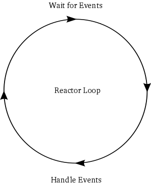

第二部分用低效的诗歌服务器来启发对Twisted机制的理解，现在我们可能要写一些代码。在开始之前，我们都做出一些必要的假设。

### 对你的假设

在展开讨论前，我假设你已经有过用Python写同步程序的经历并且至少知道一点有关Python的Sockt编程的经验。如果你从没有写过Socket程序，或许你可以去看看[Socket模块](http://docs.python.org/library/socket.html#module-socket)的文档，尤其是后面的示例代码。如果你没有用过Python的话，那后面的描述对你来说可能比看周易还痛苦。

### 对你的环境假设

我一般是在Linux上使用Twisted，这个系列的示例代码也是在Linux下完成的。首先声明的是我并没有故意让代码失去平台无关性，但我所讲述的一些内容确实可能仅仅适应于Linux和其它的类Unix（比如MAC OSX或FreeBSD）。WIndows是个奇怪诡异的地方（为什么这么评价Windows呢），如果你想尝试在它上面学习这个系列，抱歉，如果出了问题，我无法提供任何帮助。
并且假设你已经安装了Python和Twisted。我所提供的示例代码是基于Python2.5和Twisted8.2.0。
你可以在单机上运行所有的示例代码，也可以在网络系统上运行它们。但是为了学习异步编程的机制，单机上学习是比较理想的。

### 获取代码的方法

使用git工具来获取Dave的最新示例代码。在shell或其它命令行上输入以下命令（假设已经安装git）：
```
git clone git://github.com/jdavisp3/twisted-intro.git
```
下载结束后，解压并进入第一层文件夹（你可以看到有个README文件）。

### 低效的诗歌服务器

虽然CPU的处理速度远远快于网络，但网络的处理速度仍然比人脑快，至少比人类的眼睛快。因此，想通过网络来获得CPU的视角是很困难的，尤其是在单机的回路模式中数据流全速传输时，更是困难重重。

我们所需要的是一个慢速低效诗歌服务器，其用人为的可变延时来体现对结果的影响。毕竟服务器要提供点东西嘛，我们就提供诗歌好了。目录下面有个子目录专门存放诗歌用的。

最简单的慢速诗歌服务器在[blocking-server/slowpoetry.py](http://github.com/jdavisp3/twisted-intro/blob/master/blocking-server/slowpoetry.py)中实现。你可用下面的方式来运行它。
```
python blocking-server/slowpoetry.py poetry/ecstasy.txt
```
上面这个命令将启动一个阻塞的服务器，其提供"Ecstasy"这首诗。现在我们来看看它的源码内容，正如你所见，这里面并没有使用任何Twisted的内容，只是最基本的Socket编程操作。它每次只发送一定字节数量的内容，而每次中间延时一段时间。默认的是每隔0.1秒发送10个比特，你可以通过`--delay`和
`--num-bytes`参数来设置。例如每隔5秒发送50比特：
```
python blocking-server/slowpoetry.py --num-bytes 50 –-delay 5 poetry/ecstasy.txt
```
当服务器启动时，它会显示其所监听的端口号。默认情况下，端口号是在可用端口号池中随机选择的。你可能想使用固定的端口号，那么无需更改代码，只需要在启动命令中作下修改就OK了，如下所示：
```
python blocking-server/slowpoetry.py --port 10000 poetry/ecstasy.txt
```
如果你装有netcat工具，可以用如下命令来测试你的服务器（也可以用telnet）：
```
netcat localhost 10000
```
如果你的服务器正常工作，那么你就可以看到诗歌在你的屏幕上慢慢的打印出来。对！你会注意到每次服务器都会发送过一行的内容过来。一旦诗歌传送完毕，服务器就会关闭这条连接。

默认情况下，服务器只会监听本地回环的端口。如果你想连接另外一台机子的服务器，你可以指定其IP地址内容，命令行参数是 `--iface`选项。

不仅是服务器在发送诗歌的速度慢，而且读代码可以发现，服务器在服务一个客户端时其它连接进来的客户端只能处于等待状态而得不到服务。这的确是一个低效慢速的服务器，要不是为了学习，估计没有任何其它用处。

### 阻塞模式的客户端

在示例代码中有一个可以从多个服务器中顺序（一个接一个）地下载诗歌的阻塞模式的客户端。下面让这个客户端执行三个任务，正如第一个部分图1描述的那样。首先我们启动三个服务器，提供三首不同的诗歌。在命令行中运行下面三条命令：
```
python blocking-server/slowpoetry.py --port 10000 poetry/ecstasy.txt --num-bytes 30
python blocking-server/slowpoetry.py --port 10001 poetry/fascination.txt
python blocking-server/slowpoetry.py --port 10002 poetry/science.txt
```
如果在你的系统中上面那些端口号有正在使用中，可以选择其它没有被使用的端口。注意，由于第一个服务器发送的诗歌是其它的三倍，这里我让第一个服务器使用每次发送30个字节而不是默认的10个字节，这样一来就以3倍于其它服务器的速度发送诗歌，因此它们会在几乎相同的时间内完成工作。

现在我们使用阻塞模式的客户端来获取诗歌，运行如下所示的命令：
```
python blocking-client/get-poetry.py 10000 10001 10002
```
如果你修改了上面服务口器的端口，你需要在这里相应的修改以保持一致。由于这个客户端采用的是阻塞模式，因此它会一首一首的下载，即只有在完成一首时才会开始下载另外一首。这个客户端会像下面这样打印出提示信息而不是将诗歌打印出来：
```
Task 1: get poetry from: 127.0.0.1:10000
Task 1: got 3003 bytes of poetry from 127.0.0.1:10000 in 0:00:10.126361 
Task 2: get poetry from: 127.0.0.1:10001 
Task 2: got 623 bytes of poetry from 127.0.0.1:10001 in 0:00:06.321777
Task 3: get poetry from: 127.0.0.1:10002 
Task 3: got 653 bytes of poetry from 127.0.0.1:10002 in 0:00:06.617523
Got 3 poems in 0:00:23.065661
```
这图1最典型的文字版了，每个任务下载一首诗歌。你运行后可能显示的时间会与上面有所差别，并且也会随着你改变服务器的发送时间参数而改变。尝试着更改一下参数来观测一下效果。

### 异步模式的客户端

现在，我们来看看不用Twisted构建的异步模式的客户端。首先，我们先运行它试试。启动使用前面的三个端口来启动三个服务器。如果前面开启的还没有关闭，那就继续用它们好了。接下来，我们通过下面这段命令来启动我们的异步模式的客户端：
```
python async-client/get-poetry.py 10000 10001 10002
```
你或许会得到类似于下面的输出：
```
Task 1: got 30 bytes of poetry from 127.0.0.1:10000 
Task 2: got 10 bytes of poetry from 127.0.0.1:10001
Task 3: got 10 bytes of poetry from 127.0.0.1:10002
Task 1: got 30 bytes of poetry from 127.0.0.1:10000 
Task 2: got 10 bytes of poetry from 127.0.0.1:10001
...
Task 1: 3003 bytes of poetry
Task 2: 623 bytes of poetry
Task 3: 653 bytes of poetry
Got 3 poems in 0:00:10.133169
```
这次的输出可能会比较长，这是由于在异步模式的客户端中，每次接收到一段服务器发送来的数据都要打印一次提示信息，而服务器是将诗歌分成若干片段发送出去的。值得注意的是，这些任务相互交错执行，正如第一部分图3所示。

尝试着修改服务器的设置（如将一个服务器的延时设置的长一点），来观察一下异步模式的客户端是如何针对变慢的服务器自动调节自身的下载来与较快的服务器保持一致。这正是异步模式在起作用。

还需要值得注意的是，根据上面的设置，异步模式的客户端仅在10秒内完成工作，而同步模式的客户端却使用了23秒。现在回忆一下第一部分中图3与图4.通过减少阻塞时间，我们的异步模式的客户端可以在更短的时间里完成下载。诚然，我们的异步客户端也有些阻塞发生，那是由于服务器太慢了。由于异步模式的客户端可以在不同的服务器来回切换，它比同步模式的客户产生的阻塞就少得多。

### 更近一步的观察

现在让我们来读一下异步模式客户端的代码。注意其与同步模式客户端的差别：

1. 异步模式客户端一次性与全部服务器完成连接，而不像同步模式那样一次只连接一个。
2. 用来进行通信的Socket方法是非阻塞模的，这是通过调用setblocking(0)来实现的。
3. select模块中的select方法是用来识别其监视的socket是否有完成数据接收的，如果没有它就处于阻塞状态。
4. 当从服务器中读取数据时，会尽量多地从Socket读取数据直到它阻塞为止，然后读下一个Socket接收的数据（如果有数据接收的话）。这意味着我们需要跟踪记录从不同服务器传送过来诗歌的接收情况（因为，一首诗的接收并不是连续完成，所以需要保证每个任务的可连续性，就得有冗余的信息来完成这一工作）。

异步模式中客户端的核心就是最高层的循环体，即get_poetry函数。这个函数可以被拆分成两个步骤：

1. 使用select函数等待所有Socket，直到至少有一个socket有数据到来。
2. 对每个有数据需要读取的socket，从中读取数据。但仅仅只是读取有效数据，不能为了等待还没来到的数据而发生阻塞。
3. 重复前两步，直到所有的socket被关闭。

可以看出，同步模式客户端也有个循环体（在main函数内），但是这个循环体的每个迭代都是完成一首诗的下载工作。而在异步模式客户端的每次迭代过程中，我们可以完成所有诗歌的下载或者是它们中的一些。我们并不知道在一个迭代过程中，在下载哪首诗，或者一次迭代中我们下载了多少数据。这些都依赖于服务器的发送速度与网络环境。我们只需要select函数告诉我们哪个socket有数据需要接收，然后在保证不阻塞程序的前提下从其读取尽量多的数据。

如果在服务器端口固定的条件下，同步模式的客户端并不需要循环体，只需要顺序罗列三个get_poetry就可以了。但是我们的异步模式的客户端必须要有一个循环体来保证我们能够同时监视所有的socket端。这样我们就能在一次循环体中处理尽可能多的数据。

这个利用循环体来等待事件发生，然后处理发生的事件的模型非常常见，而被设计成为一个模式：reactor模式。其图形化表示如图5所示：

<div style="text-align: center"></div>
<div style="text-align: center">图5 reactor模式</div>

这个循环就是个"reactor"（反应堆），因为它等待事件的发生然后对其作相应的反应。正因为如此，它也被称作事件循环。由于交互式系统都要进行I/O操作，因此这种循环也有时被称作select loop,这是由于select调用被用来等待I/O操作。因此，在本程序中的select循环中，一个事件的发生意味着一个socket端处有数据来到。值得注意的是，select并不是唯一的等待I/O操作的函数，它仅仅是一个比较古老的函数而已（因此才被用的如此广泛）。现在有一些新API可以完成select的工作而且性能更优，它们已经在不同的系统上实现了。不考虑性能上的因素，它们都完成同样的工作：监视一系列sockets（文件描述符）并阻塞程序，直到至少有一个准备好的I/O操作。

严格意义上来说，我们的异步模式客户端中的循环并不是reactor模式，因为这个循环体并没有独立于业务处理（在此是接收具体的服务器传送来的诗歌）之外。它们被混合在一起。一个真正reactor模式的实现是需要实现循环独立抽象出来并具有如下的功能：
 
1. 监视一系列与你I/O操作相关的文件描述符（description)
2. 不停地向你汇报那些准备好的I/O操作的文件描述符

一个设计优秀的reactor模式实现需要做到：

1. 处理所有不同系统会出现的I/O事件
2. 提供优雅的抽象来帮助你在使用reactor时少花些心思去考虑它的存在
3. 提供你可以在抽象层外使用的公共协议实现。

好了，我们上面所说的其实就是Twisted — 健壮、跨平台实现了reactor模式并含有很多附加功能。

在第三部分中，实现Twisted版的下载诗歌服务时，我们将开始写一些简单的Twisted程序。

### 参考

本部分原作参见: dave <http://krondo.com/?p=1247>

本部分翻译内容参见杨晓伟的博客 <http://blog.sina.com.cn/s/blog_704b6af70100pyhh.html>
