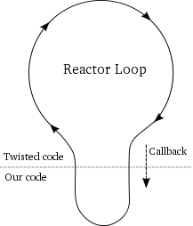

### 用twisted的方式实现前面的内容

最终我们将使用twisted的方式来重新实现我们前面的异步模式客户端。不过，首先我们先稍微写点简单的twisted程序来认识一下twisted。

最最简单的twisted程序就是下面的代码，其在`twisted-intro`目录中的[basic-twisted/simple.py](http://github.com/jdavisp3/twisted-intro/blob/master/basic-twisted/simple.py)中。
```python
from twisted.internet import reactor
reactor.run()
```
可以用下面的命令来运行它：
```
python basic-twisted/simple.py
```
正如在第二部分所说的那样，twisted实现了[Reactor模式](http://en.wikipedia.org/wiki/Reactor_pattern)，因此它必然会有一个对象来代表这个reactor或者说是事件循环，而这正是twisted的核心。上面代码的第一行引入了reactor，第二行开始启动事件循环。

这个程序什么事情也不做。除非你通过ctrl+c来终止它，否则它会一直运行下去。正常情况下，我们需要给出事件循环或者文件描述符来监视I/O（连接到某个服务器上，比如说我们那个诗歌服务器）。后面我们会来介绍这部分内容，现在这里的reactor被卡住了。值得注意的是，这里并不是一个在不停运行的简单循环。如果你在桌面上有个CPU性能查看器，可以发现这个循环体不会带来任何性能损失。实际上，这个reactor被卡住在第二部分图5的最顶端，等待永远不会到来的事件发生（更具体点说是一个调用select函数，却没有监视任何文件描述符)。

下面我们会让这个程序丰富起来，不过事先要说几个结论：

1. Twisted的reactor只有通过调用reactor.run()才启动。
2. reactor循环是在其开始的线程中运行，也就是运行在主线程中。
3. 一旦启动，reactor就会在程序的控制下（或者具体在一个启动它的线程的控制下）一直运行下去。
4. reactor空转时并不会消耗任何CPU的资源。
5. 并不需要显式的创建reactor，只需要引入就OK了。

最后一条需要解释清楚。在Twisted中，reactor是[Singleton模式](http://en.wikipedia.org/wiki/Singleton_pattern)，即在一个程序中只能有一个reactor，并且只要你引入它就相应地创建一个。上面引入的方式是twisted默认使用的方法，当然了，twisted还有其它可以引入reactor的方法。例如，可以使用twisted.internet.pollreactor来调用[poll](http://www.makelinux.net/ldd3/chp-6-sect-3.shtml)代替select方法。

若使用其它的reactor，需要在引入twisted.internet.reactor前安装它。下面是安装pollreactor的方法：
```python
from twisted.internet import pollreactor
pollreactor.install()
```
如果你没有安装其它特殊的reactor而引入了twisted.internet.reactor，那么Twisted会为你安装selectreactor。正因为如此，习惯性做法不要在最顶层的模块内引入reactor以避免安装默认reactor，而是在你要使用reactor的区域内安装。

下面是使用 pollreactor重写上面的程序，可以在[basic-twisted/simple-poll.py](http://github.com/jdavisp3/twisted-intro/blob/master/basic-twisted/simple-poll.py)文件中找到：
```python
from twited.internet import pollreactor
pollreactor.install()
from twisted.internet import reactor
reactor.run()
```
上面这段代码同样没有做任何事情。

后面我们都会只使用默认的reactor，就单纯为了学习来说 ，所有的reactor做的事情都一样。

### 你好，Twisted

我们得用Twisted来做什么吧。下面这段代码在reactor循环开始后向终端打印一条消息：
```python
def hello():
    print 'Hello from the reactor loop!'
    print 'Lately I feel like I\'m stuck in a rut.'
from twisted.internet import reactor 
reactor.callWhenRunning(hello)
print 'Starting the reactor.'
reactor.run()
```
这段代码可以在[basic-twisted/hello.py](http://github.com/jdavisp3/twisted-intro/blob/master/basic-twisted/hello.py)中找到。运行它，会得到如下结果：
```
Starting the reactor. 
Hello from the reactor loop!
Lately I feel like I'm stuck in a rut.
```
仍然需要你手动来关掉程序，因为它在打印完毕后就又卡住了。

值得注意的是，hello函数是在reactor启动后被调用的。这意味是reactor调用的它，也就是说Twisted在调用我们的函数。我们通过调用reactor的callWhenRunning函数，并传给它一个我们想调用函数的引用来实现hello函数的调用。当然，我们必须在启动reactor之前完成这些工作。

我们使用回调来描述hello函数的引用。回调实际上就是交给Twisted（或者其它框架）的一个函数引用，这样Twisted会在合适的时间调用这个函数引用指向的函数，具体到这个程序中，是在reactor启动的时候调用。由于Twisted循环是独立于我们的代码，我们的业务代码与reactor核心代码的绝大多数交互都是通过使用Twisted的APIs回调我们的业务函数来实现的。

我们可以通过下面这段代码来观察Twisted是如何调用我们代码的：
```python
import traceback
def stack():
    print 'The python stack:'
    traceback.print_stack()
from twisted.internet import reactor
reactor.callWhenRunning(stack)
reactor.run()
```
这段代码的文件是 [basic-twisted/stack.py](http://github.com/jdavisp3/twisted-intro/blob/master/basic-twisted/stack.py)。不出意外，它的输出是：
```
The python stack: 
... reactor.run() <-- This is where we called the reactor 
... ... <-- A bunch of Twisted function calls ... 
traceback.print_stack() <-- The second line in the stack function
```
不用考虑这其中的若干Twisted本身的函数。只需要关心reactor.run()与我们自己的函数调用之间的关系即可。

有关回调的一些其它说明：

Twisted并不是唯一使用回调的框架。许多历史悠久的框架都已在使用它。诸多GUI的框架也是基于回调来实现的，如GTK和QT。交互式程序的编程人员特别喜欢回调。也许喜欢到想嫁给它。也许已经这样做了。但下面这几点值得我们仔细考虑下：

1. reactor模式是单线程的。
2. 像Twisted这种交互式模型已经实现了reactor循环，意味无需我们亲自去实现它。
3. 我们仍然需要框架来调用我们自己的代码来完成业务逻辑。
4. 因为在单线程中运行，要想跑我们自己的代码，必须在reactor循环中调用它们。
5. reactor事先并不知道调用我们代码的哪个函数

这样的话，回调并不仅仅是一个可选项，而是游戏规则的一部分。

图6说明了回调过程中发生的一切：

<div style="text-align: center"></div>
<div style="text-align: center">图6 reactor启用回调</div>

图6揭示了回调中的几个重要特性：

1. 我们的代码与Twisted代码运行在同一个线程中。
2. 当我们的代码运行时，Twisted代码是处于暂停状态的。
3. 同样，当Twisted代码处于运行状态时，我们的代码处于暂停状态。
4. reactor事件循环会在我们的回调函数返回后恢复运行。

在一个回调函数执行过程中，实际上Twisted的循环是被有效地阻塞在我们的代码上的。因此，**我们应该确保回调函数不要浪费时间（尽快返回）**。特别需要强调的是，我们应该尽量避免在回调函数中使用会阻塞I/O的函数。否则，我们将失去所有使用reactor所带来的优势。Twisted是不会采取特殊的预防措施来防止我们使用可阻塞的代码的，这需要我们自己来确保上面的情况不会发生。正如我们实际看到的一样，对于普通网络I/O的例子，由于我们让Twisted替我们完成了异步通信，因此我们无需担心上面的事情发生。

其它也可能会产生阻塞的操作是读或写一个非socket文件描述符（如管道）或者是等待一个子进程完成。

如何从阻塞转换到非阻塞操作取决你具体的操作是什么，但是也有一些Twisted APIs会帮助你实现转换。值得注意的是，很多标准的Python方法没有办法转换为非阻塞方式。例如，os.system中的很多方法会在子进程完成前一直处于阻塞状态，这也就是它工作的方式。所以当你使用Twisted时，避开使用os.system。

### 退出Twisted

原来我们可以使用reactor的stop方法来停止Twisted的reactor。但是一旦reactor停止就无法再启动了。（Dave的意思是，停止就退出程序了），因此只有在你想退出程序时才执行这个操作。

下面是退出代码，代码文件是[basic-twisted/countdown.py](http://github.com/jdavisp3/twisted-intro/blob/master/basic-twisted/countdown.py)：
```python
class Countdown(object):

    counter = 5

    def count(self):
        if self.counter == 0:
            reactor.stop()
        else:
            print self.counter, '...'
            self.counter -= 1
            reactor.callLater(1, self.count)

from twisted.internet import reactor

reactor.callWhenRunning(Countdown().count)

print 'Start!'
reactor.run()
print 'Stop!'
```
在这个程序中使用了callLater函数为Twisted注册了一个回调函数。callLater中的第二个参数是回调函数，第一个则是说明你希望在将来几秒钟时执行你的回调函数。那Twisted如何来在指定的时间执行我们安排好的的回调函数。由于程序并没有监听任何文件描述符，为什么它没有像前那些程序那样卡在select循环上？select函数，或者其它类似的函数，同样会接纳一个超时参数。如果在只提供一个超时参数值并且没有可供I/O操作的文件描述符而超时时间到时，select函数同样会返回。因此，如果设置一个0的超时参数，那么会无任何阻塞地立即检查所有的文件描述符集。

你可以将超时作为图5中循环等待中的一种事件来看待。并且Twisted使用超时事件来确保那些通过callLater函数注册的延时回调在指定的时间执行。或者更确切的说，在指定时间的前后会执行。如果一个回调函数执行时间过长，那么下面的延时回调函数可能会被相应的后延执行。Twisted的callLater机制并不为硬实时系统提供任何时间上的保证。

下面是上面程序的输出：
```
Start! 
5 ... 
4 ...
3 ... 
2 ...
1 ... 
Stop!
```
### 捕获它，Twisted

由于Twisted经常会在回调中结束调用我们的代码，因此你可能会想，如果我们的回调函数中出现异常会发生什么状况。（Dave的意思是说，在结束我们的回调函数后会再次回到Twisted代码中，若在我们的回调中发生异常，那是不是异常会跑到Twisted代码中，而造成不可想象的后果 ）让我们来试试，在[basic-twisted/exception.py](http://github.com/jdavisp3/twisted-intro/blob/master/basic-twisted/exception.py)中的程序会在一个回调函数中引发一个异常，但是这不会影响下一个回调：
```python
def falldown():
    raise Exception('I fall down.')

def upagain():
    print 'But I get up again.'
    reactor.stop()

from twisted.internet import reactor

reactor.callWhenRunning(falldown)
reactor.callWhenRunning(upagain)

print 'Starting the reactor.'
reactor.run()
```
当你在命令行中运时，会有如下的输出：
```
Starting the reactor. Traceback (most recent call last):
... # I removed most of the traceback
exceptions.Exception: I fall down.
But I get up again.
```
注意，尽管我们看到了因第一个回调函数引发异常而出现的跟踪栈，第二个回调函数依然能够执行。如果你将reactor.stop()注释掉的话，程序会继续运行下去。所以说，reactor并不会因为回调函数中出现失败（虽然它会报告异常）而停止运行。

网络服务器通常需要这种健壮的软件。它们通常不希望由于一个随机的Bug导致崩溃。也并不是说当我们发现自己的程序内部有问题时，就垂头丧气。只是想说Twisted能够很好的从失败的回调中返回并继续执行。

### 继续讲解诗歌服务器

现在，我们已经准备好利用Twisted来搭建我们的诗歌服务器。在第4部分，我们会实现我们的异步模式的诗歌服务器的Twisted版。

### 参考

本部分原作参见: dave <http://krondo.com/?p=1333>

本部分翻译内容参见杨晓伟的博客 <http://blog.sina.com.cn/s/blog_704b6af70100pzhf.html>
