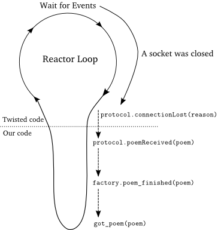

### 打造可以复用的诗歌下载客户端

我们在实现客户端上已经花了大量的工作。最新版本的（2.0）客户端使用了Transports，Protocols和Protocol Factories，即整个Twisted的网络框架。但仍有大的改进空间。2.0版本的客户端只能在命令行里下载诗歌。这是因为PoetryClientFactory不仅要下载诗歌还要负责在下载完毕后关闭程序。但这对于"PoetryClientFactory"的确是一项分外的工作，因为它除了做好生成一个PoetryProtocol的实例和收集下载完毕的诗歌的工作外最好什么也别做。

我需要一种方式来将诗歌传给开始时请求它的函数。在同步程序中我们会声明这样的API:
```python
def get_poetry(host, post):
    """Return a poem from the poetry server at the given host and port."""
```
当然了，我们不能这样做。诗歌在没有全部下载完前上面的程序是需要被阻塞的，否则的话，就无法按照上面的描述那样去工作。但是这是一个交互式的程序，因此对于阻塞在socket是不会允许的。我们需要一种方式来告诉调用者何时诗歌下载完毕，无需在诗歌传输过程中将其阻塞。这恰好又是Twisted要解决的问题。Twisted需要告诉我们的代码何时socket上可以读写、何时超时等等。我们前面已经看到Twisted使用回调机制来解决问题。因此，我们也可以使用回调：
```python
def get_poetry(host, port, callback):
    """
    Download a poem from the given host and port and invoke
 
      callback(poem)
 
    when the poem is complete.
    """
```
现在我们有一个可以与Twisted一起使用的异步API，剩下的工作就是来实现它了。

前面说过，我们有时会采用非Twisted的方式来写我们的程序。这是一次。你会在第七和八部分看到真正的Twisted方式（当然，它使用了抽象）。先简单点讲更晚让大家明白其机制。

### 客户端3.0

可以在[twisted-client-3/get-poetry.py](http://github.com/jdavisp3/twisted-intro/blob/master/twisted-client-3/get-poetry.py)看到3.0版本。这个版本实现了get_poetry方法：
```python
def get_poetry(host, port, callback):
    from twisted.internet import reactor
    factory = PoetryClientFactory(callback)
    reactor.connectTCP(host, port, factory)
```
这个版本新的变动就是将一个回调函数传递给了PoetryClientFactory。这个Factory用这个回调来将下载完毕的诗歌传回去。
```python
class PoetryClientFactory(ClientFactory):
    protocol = PoetryProtocol
 
    def __init__(self, callback):
        self.callback = callback
 
    def poem_finished(self, poem):
        self.callback(poem)
```
值得注意的是，这个版本中的工厂因其不用负责关闭reactor而比2.0版本的简单多了。它也将处理连接失败的工作除去了，后面我们会改正这一点。PoetryProtocol无需进行任何变动，我们就直接复用2.1版本的：
```python
class PoetryProtocol(Protocol):
    poem = ''
    def dataReceived(self, data):
        self.poem += data
    def connectionLost(self, reason):
        self.poemReceived(self.poem)
    def poemReceived(self, poem):
        self.factory.poem_finished(poem)
```
通过这一变动，get_poetry,PoetryClientFactory与PoetryProtocol类都完全可以复用了。它们都仅仅与诗歌下载有关。所有启动与关闭reactor的逻辑都在main中实现：
```python
def poetry_main():
    addresses = parse_args()
    from twisted.internet import reactor
    poems = []
    def got_poem(poem):
        poems.append(poem)
        if len(poems) == len(addresses):
            reactor.stop()
    for address in addresses:
        host, port = address
        get_poetry(host, port, got_poem)
    reactor.run()
    for poem in poems:
        print poem
```
因此，只要我们需要，就可以将这些可复用部分放在任何其它想实现下载诗歌功能的模块中。

顺便说一句，当你测试3.0版本客户端时，可以重新配置诗歌下载服务器来使用诗歌下载的快点。现在客户端下载的速度就不会像前面那样让人"应接不暇"了。

### 讨论

我们可以用图11来形象地展示回调的整个过程：

<div style="text-align: center"></div>
<div style="text-align: center">图11 回调过程</div>

图11是值得好好思考一下的。到现在为止，我们已经完整描绘了一个一直到向我们的代码发出信号的整个回调链条。但当你用Twisted写程序时，或其它交互式的系统时，这些回调中会包含一些我们的代码来回调其它的代码。换句话说，交互式的编程方式不会在我们的代码处止步（Dave的意思是说，我们的回调函数中可能还会回调其它别人实现的代码，即交互方式不会止步于我们的代码，这个方式会继续深入到框架的代码或其它第三方的代码）。

当你在选择Twisted实现你的工程时，务必记住下面这几条。当你作出决定：

> **I'm going to use Twisted!**

即代表你已经作出这样的决定：

> **我将程序构建在reacotr驱动的一系列异步回调链上**

现在也许你还不会像我一样大声地喊出，但它确实是这样的，这就是Twisted的工作方式。

貌似大部分Python程序与Python模块都是同步的。如果我们正在写一个同样需要下载诗歌的同步方式的程序，我可能会通过在我们的代码中添加下面几句来实现同步方式下载诗歌的客户端版本：
```python
...
import poetrylib # I just made this module name up
poem = poetrylib.get_poetry(host, port)
...
```
然后继续我们的程序。如果我们决定不需要这个这业务，那我们可以将这几行代码去掉就OK了。如果我们要用Twisted版本的get_poetry来实现同步程序，那么我们需要对异步方式中的回调进行大的改写。这里，我并不想说改写程序不好。而是想说，简单地将同步与异步的程序混合在一起是不行的。

如果你是一个Twisted新手或初次接触异步编程，建议你在试图复用其它异步代码时先写点异步Twisted的程序。这样你不用去处理因需要考虑各个模块交互关系而带来的复杂情况下，感受一下Twisted的运行机制。

如果你的程序原来就是异步方式，那么使用Twisted就再好不过了。Twisted与pyGTK和pyQT这两个基于reactor的GUI工具包实现了很好的可交互性。

### 异常问题的处理

在版本3.0中，我们没有去检测与服务器的连接失败的情况，这比在1.0版本中出现时带来的麻烦多得多。如果我们让3.0版本的客户端连到一个不存在的服务器上下载诗歌，那么不是像1.0版本那样立刻程序崩溃掉而是永远处于等待状态中。clientConncetionFailed回调仍然会被调用，但是因为其在ClientFactory基类中什么也没有实现（若子类没有重写基类函数则使用基类的函数）。因此，got_poem回调将永远不会被激活，这样一来，reactor也不会停止了。我们已经在第2部分也遇到过这样一个不做任何事情的函数了。

因此，我们需要解决这一问题，在哪儿解决呢？连接失败的信息会通过clientConnectionFailed函数传递给工厂对象，因此我们就从这个函数入手。但这个工厂是需要设计成可复用的，因此如何合理处理这个错误是依赖于工厂所使用的场景的。在一些应用中，丢失诗歌是很糟糕的;但另外一些应用场景下，我们只是尽量尝试，不行就从其它地方下载 。换句话说，使用get_poetry的人需要知道会在何时出现这种问题，而不仅仅是什么情况下会正常运行。在一个同步程序中，get_poetry可能会抛出一个异常并调用含有try/excep表达式的代码来处理异常。但在一个异步交互的程序中，错误信息也必须异步的传递出去。总之，在取得get_poetry之前，我们是不会发现连接失败这种错误的。下面是一种可能：
```python
def get_poetry(host, port, callback):
    """
    Download a poem from the given host and port and invoke
 
      callback(poem)
 
    when the poem is complete. If there is a failure, invoke:
 
      callback(None)
 
    instead.
    """
```
通过检查回调函数的参数来判断我们是否已经完成诗歌下载。这样可能会避免客户端无休止运行下去的情况发生，但这样做仍会带来一些问题。首先，使用None来表示失败好像有点牵强。一些异步的API可能会将None而不是错误状态字作为默认返回值。其次，None值所携带的信息量太少。它不能告诉我们出的什么错，更不用说可以在调试中为我呈现出一个跟踪对象了。好的，也可以尝试这样：
```python
def get_poetry(host, port, callback):
    """
    Download a poem from the given host and port and invoke
 
      callback(poem)
 
    when the poem is complete. If there is a failure, invoke:
 
      callback(err)
 
    instead, where err is an Exception instance.
    """
```
使用Exception已经比较接近于我们的异步程序了。现在我们可以通过得到Exception来获得相比得到一个None多的多的出错信息了。正常情况下，在Python中遇到一个异常会得到一个跟踪异常栈以让我们来分析，或是为了日后的调试而打印异常信息日志。跟踪栈相当重要的，因此我们不能因为使用异步编程就将其丢弃。

记住，我们并不想在回调激活的地反打印跟踪栈，那并不是出问题的地方。我们想得到是Exception实例和其被抛出的位置。

Twisted含有一个抽象类称作Failure，如果有异常出现的话，其能捕获Exception与跟踪栈。

Failure的描述文档说明了如何创建它。将一个Failure对象付给回调函数，我们就可以为以后的调试保存跟踪栈的信息了。

在[twisted-failure/failure-examples.py](http://github.com/jdavisp3/twisted-intro/blob/master/twisted-failure/failure-examples.py)中有一些使用Failure对象的示例代码。它演示了Failure是如何从一个抛出的异常中保存跟踪栈信息的，即使在except块外部。我不用在创建一个Failure上花太多功夫。在第七部分中，我们将看到Twisted如何为我们完成这些工作。好了，看看下面这个尝试：
```python
def get_poetry(host, port, callback):
    """
    Download a poem from the given host and port and invoke
      callback(poem)
    when the poem is complete. If there is a failure, invoke:
      callback(err)
     instead, where err is a twisted.python.failure.Failure instance.
    """
```
在这个版本中，我们得到了Exception和出现问题时的跟踪栈。这已经很不错了！

大多数情况下，到这个就OK了，但我们曾经遇到过另外一个问题。使用相同的回调来处理正常的与不正常的结果是一件莫名奇妙的事。通常情况下，我们在处理失败信息和成功信息要进行不同的操作。在同步Python编程中，我们经常在处理失败与成功两种信息上采用不同的处理路径，即try/except处理方式：
```python
try:
    attempt_to_do_something_with_poetry()
except RhymeSchemeViolation:
    # the code path when things go wrong
else:
    # the code path when things go so, so right baby
```
如果我们想保留这种错误处理方式，那么我们需要独立的代码来处理错误信息。那么在异步方式中，这就意味着一个独立的回调：
```python
def get_poetry(host, port, callback, errback):
    """
    Download a poem from the given host and port and invoke
      callback(poem)
    when the poem is complete. If there is a failure, invoke:
      errback(err)
    instead, where err is a twisted.python.failure.Failure instance.
    """
```
### 版本3.1

版本3.1实现位于[twisted-client-3/get-poetry-1.py](http://github.com/jdavisp3/twisted-intro/blob/master/twisted-client-3/get-poetry-1.py)。改变是很直观的。PoetryClientFactory，获得了callback和errback两个回调，并且其中我们实现了clientConnectFailed：
```python
class PoetryClientFactory(ClientFactory):
    protocol = PoetryProtocol
    def __init__(self, callback, errback):
        self.callback = callback
        self.errback = errback 
    def poem_finished(self, poem):
        self.callback(poem)
    def clientConnectionFailed(self, connector, reason):
        self.errback(reason)
```
由于[clientConnectionFailed](http://twistedmatrix.com/trac/browser/trunk/twisted/internet/protocol.py)已经收到一个Failure对象（其作为reason参数）来解释为什么会发生连接失败，我们直接将其交给了errback回调函数。
直接运行3.1版本（无需开启诗歌下载服务）的代码：
```
python twisted-client-3/get-poetry-1.py 10004
```
你会得到如下输出：
```
Poem failed: [Failure instance: Traceback (failure with no frames):: 
    Connection was refused by other side: 111: Connection refused. ]
```
这是由poem_failed回调中的print函数打印出来的。在这个例子中，Twisted只是简单将一个Exception传递给了我们而没有抛出它，因此这里我们并没有看到跟踪栈。因为这并不一个Bug，所以跟踪栈也不需要，Twisted只是想通知我们连接出错。

### 总结

我们在第六部分学到：

+ 我们为Twisted程序写的API必须是异步的
+ 不能将同步与异步代码混合起来使用
+ 我们可以在自己的代码中写回调函数，正如Twisted做的那样
+ 并且，我们需要写处理错误信息的回调函数

使用Twisted时，难道我们在写自己的API时都要额外的加上两个参数：正常的回调与出现错误时的回调? 幸运的是，Twisted使用了一种机制来解决了这一问题，我们将在第七部分学习这部分内容。

### 参考

本部分原作参见: dave @ <http://krondo.com/?p=1595>

本部分翻译内容参见杨晓伟的博客 <http://blog.sina.com.cn/s/blog_704b6af70100q4by.html>
