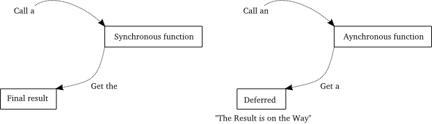
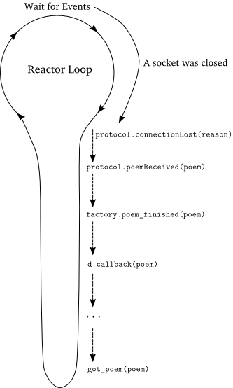

### 客户端4.0

我们已经对deferreds有些理解了，现在我们可以使用它重写我们的客户端。你可以在[twisted-client-4/get-poetry.py](http://github.com/jdavisp3/twisted-intro/blob/master/twisted-client-4/get-poetry.py)中看到它的实现。

这里的get_poetry已经再也不需要callback与errback参数了。相反，返回了一个用户可能根据需要添加callbacks和errbacks的新deferred。
```python
def get_poetry(host, port):
    """
    Download a poem from the given host and port. This function
    returns a Deferred which will be fired with the complete text of
    the poem or a Failure if the poem could not be downloaded.
    """
    d = defer.Deferred()
    from twisted.internet import reactor
    factory = PoetryClientFactory(d)
    reactor.connectTCP(host, port, factory)
    return d
```
这里的工厂使用一个deferred而不是callback/errback来初始化。一旦我们获取到poem或者没有连接到服务器，deferred就会以返回一首诗歌或一个failure的方式被激活。
 ```python
class PoetryClientFactory(ClientFactory):
 
    protocol = PoetryProtocol
 
    def __init__(self, deferred):
        self.deferred = deferred
 
    def poem_finished(self, poem):
        if self.deferred is not None:
            d, self.deferred = self.deferred, None
            d.callback(poem)
 
    def clientConnectionFailed(self, connector, reason):
        if self.deferred is not None:
            d, self.deferred = self.deferred, None
            d.errback(reason)
```
注意我们在deferred被激活后是如何销毁其引用的。这种方式普便存在于Twisted的源代码中，这样做可以保证我们不会激活一个deferred两次。这也为Python的垃圾回收带来了方便。

这里仍然不用去改变poetryProtocol。我们只需要更新poetry_main函数即可：
```python
def poetry_main():
    addresses = parse_args()
 
    from twisted.internet import reactor
 
    poems = []
    errors = []
 
    def got_poem(poem):
        poems.append(poem)
 
    def poem_failed(err):
        print >>sys.stderr, 'Poem failed:', err
        errors.append(err)
 
    def poem_done(_):
        if len(poems) + len(errors) == len(addresses):
            reactor.stop()
 
    for address in addresses:
        host, port = address
        d = get_poetry(host, port)
        d.addCallbacks(got_poem, poem_failed)
        d.addBoth(poem_done)
 
    reactor.run()
 
    for poem in poems:
        print poem
```
注意看我们是如何利用deferred的回调链特性，从先前的callback与errback回调中，重构出poem_done调用的。

由于deferred在Twisted大量被使用，使用小写字母d来表示当前正在工作中的deferred已经成为惯例。

### 讨论

新版本的客户端与我们前面的同步版本的客户端一样，get_poetry得到的参数都是诗歌下载服务器的地址。同步版本返回的是诗歌内容，而异步版本返回的却是一个deferred。返回一个deferred是Twisted的APIs或用Twisted写的程序常见的，这样一来我们可以这样来理解deferred：

> **一个Deferred代表了一个"异步的结果"或者"结果还没有到来"**

在图13中可以更加清晰地表达出两者之间的不同：

<div style="text-align: center"></div>
<div style="text-align: center">图13 同步 VS 异步</div>

异步函数返回一个deferred，对用户意味着：

> **我是一个异步函数，不管你想要什么，可能现在马上得不到，但当结果来到时，我会激活这个deferred的callback链并返回结果；或者当出错时，相应地激活errback链并返回出错信息。**

当然，这个函数是不能随意激活这个deferred的，因为它已经返回了。但这个函数已经启动了一系列事件，这些事件最终将会激活这个deferred。

因此，deferred是为适应异步模式的一种延迟函数返回的方式。函数返回一个deferred意味着其是异步的，代表着将来的结果，也是对将来能够返回结果的一种承诺。

> **同步函数也能返回一个deferred，因此严格来说，返回deferred只能说可能是异步的。我们会在将来的例子中会看到同步函数返回deferred。**

由于deferred的行为已经很好的定义与理解，因此在实现自己的API时返回一个deferred更容易让其它的Twisted程序理解你的代码。如果没有deferred，可能每个人写的模块都使用不同的方式来处理回调，如果这样就增加了相互理解的工作量。

> **当你使用Deferred时，你仍然在使用回调，它们仍然由reactor来调用。**

当首次学习Twisted时，经常犯的一个错误就是：会给deferred增加一些它本身不能实现的功能。尤其是：经常假设在deferred上添加一个函数就可以使其变成异步函数。这可能会让你产生这样的想法：在Twisted 中可以通过将os.system的函数添加到deferred的回调链中。

我认为，这可能是没有弄清楚异步编程的原因才产生这样的想法。由于Twisted代码使用了大量的deferred但却很少会涉及到reactor，可能会认为deferred做了大部分工作。如果你是从开始阅读这个系列的，你就会知道事情远不是这样。虽然Twisted是由众多部分组合在一起来工作的，但实现异步的主要工作都是由reactor来完成的。Deferred是一个很好的抽象概念，但前面几个例子中的客户端我们却没有使用它，而reactor却都用到了。

来看看我们第一个回调激活时的跟踪栈信息。运行[twisted-client-4/get-poetry-stack.py](http://github.com/jdavisp3/twisted-intro/blob/master/twisted-client-4/get-poetry-stack.py)让其连接你打开的服务器：
```
  File "twisted-client-4/get-poetry-stack.py", line 129, in
    poetry_main()
  File "twisted-client-4/get-poetry-stack.py", line 122, in poetry_main
    reactor.run()

  ... # some more Twisted function calls

    protocol.connectionLost(reason)
  File "twisted-client-4/get-poetry-stack.py", line 59, in connectionLost
    self.poemReceived(self.poem)
  File "twisted-client-4/get-poetry-stack.py", line 62, in poemReceived
    self.factory.poem_finished(poem)
  File "twisted-client-4/get-poetry-stack.py", line 75, in poem_finished
    d.callback(poem) # here's where we fire the deferred

  ... # some more methods on Deferreds

  File "twisted-client-4/get-poetry-stack.py", line 105, in got_poem
    traceback.print_stack()
```
这很像版本2.0的跟踪栈，图14可以很好地说明具体的调用关系：

<div style="text-align: center"></div>
<div style="text-align: center">图14 deferred的回调</div>

这很类似于我们前面的Twisted客户端，虽然这张图的调用关系并不清晰而会让你摸不着头脑。但我们先不深入分析这张图。有一个细节并没有在这张图上反映出来：callback链直到第二个回调poem_done激活前才将控制权还给reactor。

通过使用deferred，我们在由Twisted中的reactor启动的回调中加入了一些自己的东西，但我们并没有改变异步程序的基础架构。回忆下回调编程的特点：

1. 在一个时刻，只会有一个回调在运行
2. 当reactor运行时，那我们自己的代码则得不到运行
3. 反之亦然
4. 如果我们的回调函数发生阻塞，那么整个程序就跟着阻塞掉了

在一个 deferred上追加一个回调并不会改变上面这些实事。尤其是，第4 条。因此当一个deferred激活时被阻塞，那么整个Twisted就会陷入阻塞中。因此我们会得到如下结论：

> **Deferred只是解决回调函数管理问题的一种解决方案，它并不替代回调方式，也不能将阻塞式的回调变成非阻塞式回调的。**

我通过构建一个添加阻塞式回调的deferred来验证最后一点。验证代码文件为[twisted-deferred/defer-block.py](http://github.com/jdavisp3/twisted-intro/blob/master/twisted-deferred/defer-block.py)。第二个callback通过使用time.sleep来达到阻塞的效果。如果你运行该代码来观察打印信息顺序时，你会发现deferred中阻塞回调仍然会是阻塞的。

### 总结

函数通过返回一个Deferred，向使用者暗示"我是采用异步方式的"并且当结果到来时会使用一种特殊的机制（在此处添加你的callback与errback）来获得返回结果。Defered被广泛地运用在Twisted的每个角落，当你浏览Twisted源码时你就会不停地遇到它。

4.0版本客户端是第一个使用Deferred的Twisted版的客户端，其使用方法为在其异步函数中返回一个deferred。可以使用一些Twisted的APIs来使客户端的实现更加清晰些，但我觉得它能够很好地体现出一个简单的Twisted程序是怎么写的了，至少对于客户端可以如此肯定。事实上，后面我们会重构我们的服务器端。

但我们对Deferred的讲解还没有结束。使用如此少量的代码，Deferred就能提供如此之多的功能。我们将在第9部分探讨其更多的功能和功能背后的动机。

### 参考

本部分原作参见: dave @ <http://krondo.com/?p=1778>

本部分翻译内容参见杨晓伟的博客 <http://blog.sina.com.cn/s/blog_704b6af70100q6oi.html>
