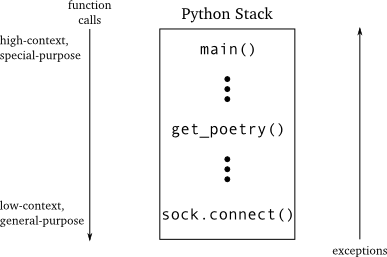
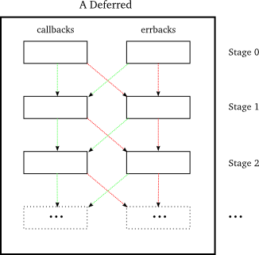
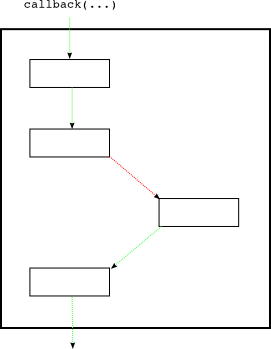

### 更多关于回调的知识

稍微停下来再思考一下回调的机制。尽管对于以Twisted方式使用Deferred写一个简单的异步程序已经非常了解了，但Deferred提供更多的是只有在比较复杂环境下才会用到的功能。因此，下面我们自己想出一些复杂的环境，以此来观察当使用回调编程时会遇到哪些问题。然后再来看看deferred是如何解决这些问题的。

因此，我们为诗歌下载客户端添加了一个假想的功能。设想一些计算机科学家发明了一种新诗歌关联算法，Byronification引擎。这个漂亮的算法根据一首诗歌生成一首使用[Lord Byron](http://en.wikipedia.org/wiki/George_Gordon_Byron,_6th_Baron_Byron)风格的诗歌。另外，专家们提供了其Python的接口，即：
```python
class IByronificationEngine(Interface): 
    def byronificate(poem):
        """
        Return a new poem like the original, but in the style of Lord Byron.
        Raises GibberishError if the input is not a genuine poem.
        """
```
像大多数高尖端的软件一样，其实现存在着许多bugs。这意外着除了已知的异常外，这个byronificate 方法可能会抛出一些专家当时没有预料到的异常出来。

我们还可以假设这个引擎能够非常快的动作以至于我们可以在主线程中直接同步调用而无需考虑使用reactor做异步调用。下面是我们想让程序实现的效果：

1. 尝试下载诗歌
2. 如果下载失败，告诉用户没有得到诗歌
3. 如果下载到诗歌，则转交给Byronificate处理引擎一份
4. 如果引擎抛出GibberishError，告诉用户没有得到诗歌
5. 如果引擎抛出其它异常，则将原始式样的诗歌给用户
6. 如果我们得到这首诗歌，则打印它
7. 结束程序

这里设计的是当遇到GibberishError异常则表示没有得到诗歌，因此我们直接告诉用户下载失败即可。这也许对调试没什么用处，但我们的用户关心的只是我们下载到诗歌没有。另一方面，如果引擎因为一些其它的原因而出现处理失败，那么我们将原始诗歌交给用户。毕竟，有诗歌呈现总比没有好，虽然不是用户想要的Byron样式。

下面是同步模式的代码：
```python
try:
    poem = get_poetry(host, port) # synchronous get_poetry
except:
    print >>sys.stderr, 'The poem download failed.'
else:
    try:
        poem = engine.byronificate(poem)
    except GibberishError:
        print >>sys.stderr, 'The poem download failed.'
    except:
        print poem # handle other exceptions by using the original poem
    else:
        print poem
sys.exit()
```
这段代码可能经过一些重构会更加简单，但已经足以说明上面的逻辑流程。我们想升级那些最近使用deferred的客户端来使用这个功能。但这部分内容我准备把它放在第十部分。现在，我们来考虑一下，用版本3.1来实现这个功能，最后一个没有使用deferred的客户端。假设我们无需考虑处理异常，那么只是改变一下got_poem回调即可：
```python
def got_poem(poem):
    poems.append(byron_engine.byronificate(poem))
    poem_done()
```
那么如果byronificate抛出GibberishError异常或其它异常会发生什么呢？看看第六部分的图11,我们可以得到：

1. 这个异常会传播到工厂中的poem_finished回调，即激活got_poem的方法
2. 由于poem_finished并没有捕获这个异常，因此其会传递到protocol中的poemReceive函数
3. 然后来到connectionLost函数，仍然在protocol中
4. 然后就来到Twisted的核心区，最后止步于reactor。

前面已经了解到，reactor会捕获异常并记录它而不是"崩溃"掉。但它却不会告诉用户我们的诗歌下载失败的消息。reactor并不知道任何诗歌或GibberishErrors的信息，它只是一段被设计成适应所有网络类型的通用代码，即便与诗歌无关的网络服务。（Dave这里想强调的是reactor只是做一些具有普遍意义的事情，不会单独去处理特定的问题，例如这里的GibberishErrors异常）

注意异常是如何顺着调用链传递到具有通用性代码区域。并且可以看到，在got_poem后面任何一步都没有可能以符合我们客户端的具体要求来处理异常的机会。这与同步代码中的方式恰恰相反。

图15揭示了一个同步客户端的调用栈：

<div style="text-align: center"></div>
<div style="text-align: center">图15 同步调用栈</div>

main函数是最高层，意味着它可以触及整个程序，它明白自己存在的位置，并且知道如何处理低层调用的结果。典型的，main函数可以触及到用户想让程序做什么而输入的命令行参数。并且它还有一个特殊的目的：为一个命令行式的客户端打印结果。

socket的connet函数，恰恰相反，其为最低层。它所知道的就是提供到指定地址的连接。它并不知道另一端是什么以及我们为什么要进行连接。connect作为通用功能，不管你需要连接到哪种服务器。

get_poetry在中间，它知道要取一些诗歌，但并不知道如果得不到诗歌会发生什么。因此，从connect抛出的异常会向上传递，从低层的具有通用性的代码区到高层的具有针对性的代码区，直到其传递到知道如何处理这个异常的代码区。

现在，我们再回来看看对3.1版的假想功能的实现。我们在图16里对调用栈进行了分析，当然只是标明了其中关键的函数：

<div style="text-align: center"></div>
<div style="text-align: center">图16 异步调用栈</div>

现在问题非常清晰了：在回调中，低层的代码（reactor）调用高层的代码，其甚至还会调用更高层的代码。因此一旦出现了异常，它并不会立即被其附近（在调用栈中可触及）的代码捕获，当然附近的代码也不可能处理它。由于异常每向上传递一次，就越靠近低层那些通用的底层代码，所以更加不知如何处理该异常。

一旦异常来到Twisted的核心代码区，游戏也就结束了。异常并不会被处理，只是被记录下来。因此我们在以最原始的回调方式使用回调时（不使用deferred），必须在其进入Twisted之间很好地处理各种异常，至少是我们知道的那些在我们自己设定的规则下会产生的异常。当然其也应该包括那些由我们自己的BUG产生的异常。

由于bug可能存在于我们代码中的每个角落，因此我们必须将每个回调都放入try/except中，这样一来所有的异常都才有可能被捕获。这对于我们的errback同样适用，因为errback中也可能含有bugs。

### Deferred的优秀架构

最终还得由Deferred来帮我们解决这类问题。当一个deferred激活了一个callback或errback时，它就会捕获各种由回调抛出的异常。换句话说，deferred扮演了try/except模块，这样一来，只要我们使用deferred就无需自己来实现这一层了。那deferred是如何解决这个问题的？很简单，它传递异常给在其链上的下一个errback。

我们添加到deferred中的第一个errback回调来处理任何出错信息，信息是在deferred的errback函数调用时发出的。但第二个errback会处理任何由第一个errback或第一个callback抛出的异常，并一直按这种规则传递下去。

回忆下图12.我们假设第一对callback/errback是stage0,下面则是stage1，stage2。。。依次类推。

对于stage N来说，如果其callback或errback出错，那么stage N+1的errback就会被调用并收到一个Failure对象作为参数，同时stage N+1的callback就不会被调用了。

通过将回调函数产生的异常向在链中传递，deferred将异常抛向了高层代码。这也意味着调用deferred的callback与errback永远不会在调用本身处引发异常（只要你仅激活deferred一次），因此，底层的代码可以放心的激活deferred而无需担心会引发异常。相反，高层代码通过向deferred中添加errback（使用addErrback）来捕获异常。

在同步代码中，异常会在其被捕获后停止传递，那么一个errback如何发出其捕获了异常这一信号呢？同样很简单：不再引发异常。这样一来，执行权就转移到了callback中来。因此对于stage N来说，不管是callback还是errback成功执行而没有抛出异常，那么stage N+1的callback就会被调用，同样，stage N+1的errback就不会被调用了。

我们来总结一下吧：

1. 一个deferred有一个callback/errback对链，它们以添加到deferred中的顺序依次排列
2. stage 0，即第一对callback/errback，会在deferred激活时调用，具体调用那个看激活deferred的方式，若是通过.errback激活，则调用errback；若是通过.callback激活则调用callback。
3. 如果stage N执行出现异常，则stage N+1的errback被调用，并且其参数即为stage N出现的异常
4. 同样，如果stage N成功，即没有抛出异常，则N+1的callback被调用，其第一个参数为stage N的返回值。

图17更加直观的描述上述操作：

<div style="text-align: center"></div>
<div style="text-align: center">图17 deferred中的控制流程</div>

绿色的线表示callback和errback成功执行没抛出异常，而红线表示出现了异常。这些线不仅说明了控制流程还说明了异常与返回值在链中流动的情况。图17显示了所有deferred能出现的可能路径，但实际只有一条路径会存在。图18显示了一条可能的路径：

<div style="text-align: center"></div>
<div style="text-align: center">图18 可能的deferred激活路线</div>

图18中，deferred的.callback函数被调用了，因此激活了stage 0的callback。这个callback成功的执行而没有抛出异常，因此控制权传给了stage 1的callback。但这个callback执行失败而抛出异常，因此控制权传给了stage 2的errback。errback成功的处理了异常，而没有再抛出异常，因此控制权传给了stage 3的callback，并且将errback的返回值作为第一个参数传了进来（即stage 3的callback中）。

图18中，可以看出，每一层stage上的回调(callback/errback)出现异常时，都由下一层的errback来捕获并处理，但如果最后一个stage的callback或errback执行失败而抛出异常，怎么办呢？那么这个异常就会成为unhandled（未处理）。

在同步代码中，未处理的异常会导致解释器崩溃，在原始方式使用回调的代码中未处理异常会由reactor捕获并记录下来。那么未处理异常出现在deferred中会怎样呢？让我们来做个试验。运行[twisted-deferred/defer-unhandled.py](http://github.com/jdavisp3/twisted-intro/blob/master/twisted-deferred/defer-unhandled.py)试试。下面是输出：
```
Finished
Unhandled error in Deferred:
Traceback (most recent call last):
  ...
--- <exception caught here> ---
  ...
exceptions.Exception: oops
```
如下几点需要引起我们的注意：

1. 最后一个print函数成功执行，意味着程序并没有因为出现未处理异常而崩溃。
2. 其只是将跟踪栈打印出来，而没有宕掉解释器
3. 跟踪栈的内容告诉我们deferred在何处捕获了异常
4. "Unhandle"的字符在"Finished"之后出现。

之所以出现第4条是因为，这个消息只有在deferred被垃圾回收时才会打印出来。我们将在下面的部分看到其中的原因。
在同步代码中，我们可以使用raise来重新抛出一个异常而无需其它参数。同样，我们也可以在errback中这样做。deferred通过以下两点来判断callback/errback是否执行成功：

+ callback/errback "raise"一个异常，或
+ callbakc/errback返回一个Failure对象

由于errback的第一个参数就是一个Failure，因此一个errback可以在进行完处理后再次抛出这个Failure。

### Callbacks与Errbacks，成对出现

上面讨论内容中的一个问题必须要清楚：你添加callback与errback到一个defered的顺序会决定这个deferred的的整体运行情况。另一个必须搞清楚的是：在一个deferred中callback与errback往往是成对出现。有四个方法可以向一个deferred的回调链中添加callback/errback对：
```
addCallbacks
addCallback
addErrback
addBoth
```
很明显的是，第一个与第四个是向链中添加函数对。当然中间两个也向链中添加函数对。addCallback向链中添加一个显式的callback函数与一个隐式的"pass-through"函数（实在想不出一个对应的词）。一个pass-through函数只是虚设的函数，只将其第一个参数返回。由于errback回调函数的第一个参数是Failure，因此一个"path-through"的errback总是执行"失败"，即将异常传给下个errback回调。

### deferred模拟器

弄清楚deferreds是如何启动(fire)它们的callbacks和errbacks是个不错的想法。在twisted-deferred/deferred-simulator.py中的python脚本是个“deferred 仿真器”，这是一个能让你搞清楚deferreds是如何启动(fire)的python小程序。当你跑这个脚本的时候，它会让你(按照它提供的格式)输入一系列的callback和errback回调函数对，每行输入一对回调函数。对于每个你输入的callback或者errback回调，你可以指定一个动作，如下：
1. 回调成功执行，且返回一个(由你)给定的值，或者
2. 回调执行失败，且抛出一个(由你)给定的异常(exception)，或者
3. 回调是一个pass-through函数，只是直接将其收到的参数返回。

含分别从callback和errback回调函数链开始的两条激活路线。为了正确地显示这张仿真路线图，你的终端窗口最好足够宽。当然，你也可以用--narrow选项来一个接一个地将两个激活路线图内容在终端上打印出来，但是为了看清楚这两个激活路线图之间的关系，你最好让它们并排显示。

当然，在实际的代码中，一个callback是不会每次都返回相同的值，并且一个给定的函数可能会有时执行成功，有时执行失败。但是这个仿真的目的是给你一个全方位的视角，来看清在一个给定的callback和errback链中，对于一组给定的函数返回值以及异常，一可能的deferred激活路线(firing pattern)会是什么样的。

### 总结

经过这些对回调的考虑，发现由于回调式编程改变了低层代码与高层代码的关系，因此让回调产生的异常直接抛到栈中并不是一件好事。Deferred通过将异常捕获然后将其顺着回调链传递来解决了这个问题。

我们学习到了原始数据（返回值）在链中如何被很好的传递。综合所述给大家带来了这样一种场景：deferred根据每一层stage返回的结果的不同，在callback与errback链中来回交错传递数据并执行。

我们将在第十部分使用这些学到的知识来更新我们的客户端。

### 参考

本部分原作参见: dave @ <http://krondo.com/?p=1825>

本部分翻译内容参见杨晓伟的博客 <http://blog.sina.com.cn/s/blog_704b6af70100q7nc.html>
