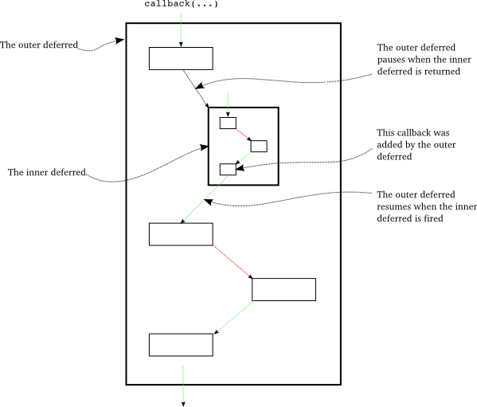
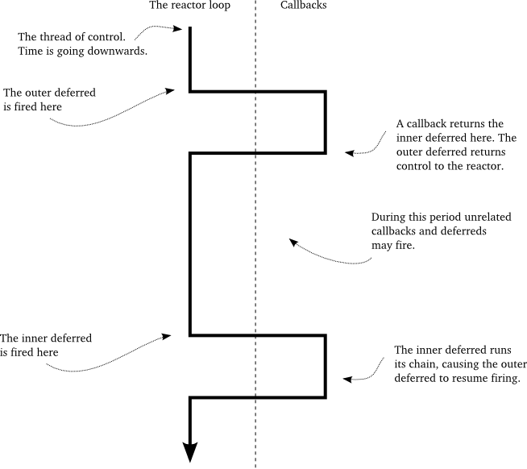

### 介绍

回忆下第10部分中的客户端5.1版。客户端使用一个Deferred来管理所有的回调链，其中包括一个格式转换引擎的调用。在那个版本中，这个引擎的实现是同步的。

现在我们想实现一个新的客户端，使用我们在第十二部分实现的服务器提供的格式转换服务。但这里有一个问题需要说清楚：由于格式转换服务是通过网络获取的，因此我们需要使用异步I/O。这也就意味着我们获取格式转换服务的API必须是异步实现的。换句话说，try_to_cummingsify回调将会在新客户端中返回一个 deferred。

如果在一个deferred的回调链中的一个函数又返回了一个 deferred会发生什么现象呢？我们规定前一个deferred为外层deferred，而后者则为内层deferred。假设回调N在外层deferred中返回一个内层的deferred。意味着这个回调宣称“我是一个异步函数，结果不会立即出现！”。由于外层的deferred需要调用回调链中下一个callback或errback并将回调N的结果传下去，因此，其必须等待直到内层deferred被激活。当然了，外层的deferred不可能处于阻塞状态，因为控制权此时已经转交给了reactor并且阻塞了。

那么外层的deferred如何知晓何时恢复执行呢？很简单，在内层deferred上添加callback或errback即可（即激活内层的deferred）。因此，当内层deferrd被激活时，外层的deferred恢复其回调链的执行。当内层deferred回调执行成功，那么外层deferred会调用第N+1个callback回调。相反，如果内层deferred执行失败，那么外层deferred会调用第N+1个errback回调。

图28形象地解释说明了这一过程：

<div style="text-align: center"></div>
<div style="text-align: center">图28 内层与外层deferred的交互</div>

在这个图示中，外层的deferred有四个callback/errback对。当外围的deferred被激活后，其第一个callback回调返回了一个deferred（即内层deferred）。从这里开始，外层的deferred停止激活其回调链并且将控制权交还给了reactor（当然是在给内层deferred添加callback/errback之后）。过了一段时间之后，内层deferred被激活，然后执行它的回调链并执行完毕后恢复外层deferred的回调执行过程。注意到，外层deferred是无法激活内层deferred的。这是不可能的，因为外层的deferred根本就无法获知内层的deferred何时能把结果准备好及结果内容是什么。相反，外层的deferred只可能等待（当然是异步方式）内部deferred的激活。

注意到外层deferred的产生内层deferred的回调的连线是黑色的而不是红色或蓝色，这是因为我们在内层deferred激活之前是无法获知此回调返回的结果是执行成功还执行失败。只有在内层deferred激活时，我们才能决定下一个回调是callback还是errback。

图29从reactor的角度来说明了外层与内层deferred的执行序列：

<div style="text-align: center"></div>
<div style="text-align: center">图29 控制权的转换</div>
 
这也许是Deferred类最为复杂的功能，但无需担心你可能会花费大量时间来理解它。我们将在示例[twisted-deferred/defer-10.py](http://github.com/jdavisp3/twisted-intro/blob/master/twisted-deferred/defer-10.py)中说明如何使用它。这个例子中，我们创建了两个外层deferred，一个使用了简单的回调，另一个其中的一个回调返回了一个内部deferred。通过阅读这段代码，我们可以发现外层deferred是在内层deferred激活后才开始继续执行回调链的。

### 客户端版本6.0

我们将使用新学的deferred嵌套来重写我们的客户端来使用由服务器提供的样式转换服务。其实现代码在[twisted-client-6/get-poetry.py](http://github.com/jdavisp3/twisted-intro/blob/master/twisted-client-6/get-poetry.py)中。与前几个版本一样，协议与工厂都没有改变。但我们添加了进行格式转换服务请求的协议与工厂实现。下面是协议实现代码：
```python
class TransformClientProtocol(NetstringReceiver):
    def connectionMade(self):
        self.sendRequest(self.factory.xform_name, self.factory.poem)
    def sendRequest(self, xform_name, poem):
        self.sendString(xform_name + '.' + poem)
    def stringReceived(self, s):
        self.transport.loseConnection()
        self.poemReceived(s)
    def poemReceived(self, poem):
        self.factory.handlePoem(poem)
```
使用NetstringReceiver作为基类可以很简单地实现我们的协议。只要连接一旦建立我们就发出格式转换服务的请求。当我们得到格式转换之后的诗歌后交给工厂进行处理，下面是工厂代码：
```python
class TransformClientFactory(ClientFactory):
    protocol = TransformClientProtocol
    def __init__(self, xform_name, poem):
        self.xform_name = xform_name
        self.poem = poem
        self.deferred = defer.Deferred()
    def handlePoem(self, poem):
        d, self.deferred = self.deferred, None
        d.callback(poem)
    def clientConnectionLost(self, _, reason):
        if self.deferred is not None:
            d, self.deferred = self.deferred, None
            d.errback(reason)
    clientConnectionFailed = clientConnectionLost
```
值得注意的是，工厂是如何处理这两种类型错误：连接失败和诗歌未全部接收就中断连接。clientConncetionLost可能会在我们已经接收完诗歌后激活执行（即连接断开了），但在这种情况下，self.deferred已经是个None值，这得益于handePoem中对deferredr 处理。

这个工厂创建了一个deferred并且最后激活了它，这在Twisted编程中是一个好的习惯，即

> **通常情况下，一个对象创建了一个deferred，那么它应当负责激活它。**

除了格式转换工厂外，还有一个Proxy类包装了具体创建一个TCP连接到格式转换服务器：
```python
class TransformProxy(object):
    """
    I proxy requests to a transformation service.
    """
    def __init__(self, host, port):
        self.host = host
        self.port = port
    def xform(self, xform_name, poem):
        factory = TransformClientFactory(xform_name, poem)
        from twisted.internet import reactor
        reactor.connectTCP(self.host, self.port, factory)
        return factory.deferred
```
这个类提供了一个xform接口，以让其它程序请求格式转换服务。这样一来其它代码只需要提出请求并得到一个deferred，而无需考虑什么端口与IP地址之类的问题。

剩下的代码除了try_to_cummingsify外都没有改变：
```python
def try_to_cummingsify(poem):
    d = proxy.xform('cummingsify', poem)
    def fail(err):
        print >>sys.stderr, 'Cummingsify failed!'
        return poem
    return d.addErrback(fail)
```
这个作为外层deferred的回调返回了一个内层的deferred，main函数除了修改创建一个Proxy对象这个地方，其他地方都不需要修改。由于try_to_cummingsify已经是deferred回调链中的一部分，因此其早已使用了异步方式， 这里无需更改。

你可能注意到return d.addErrback(fail)这句，其等价于
```python
d.addErrback(fail)
return d
```

### 测试客户端

新版客户端的启动和老版的稍微有点不同，如果有1个带诗歌转换服务的服务器运行10001端口，2个诗歌下载服务器分别运行在10002和10003端口， 你可以这样启动客户端：
```
python twisted-client-6/get-poetry.py 10001 10002 10003
```
它会从诗歌下载服务器下载2首诗歌，然后通过诗歌转换服务器转换它们。你可以这样启动诗歌转换服务器：
```
python twisted-server-1/transformedpoetry.py --port 10001
```
启动2个诗歌下载服务器：
```
python twisted-server-1/fastpoetry.py --port 10002 poetry/fascination.txt
python twisted-server-1/fastpoetry.py --port 10003 poetry/science.txt
```
现在就可以像上面一样运行诗歌客户端了。下面你可以尝试这样的场景， 让诗歌转换服务器崩掉， 然后用同样的命令再次运行诗歌客户端。

### 结束语

这一部分我们学习了关于deferred如何透明地在完成了内部(deferred)回调链后继续处理的过程。并由此，我们可以无需考虑内部实现细节并放心地在外部deferred上添加回调。

在第十四部分，我们将讲解deferred的另外一个特性。

### 参考

本部分原作参见: dave @ <http://krondo.com/?p=2159>

本部分翻译内容参见杨晓伟的博客 <http://blog.sina.com.cn/s/blog_704b6af70100qay3.html>
