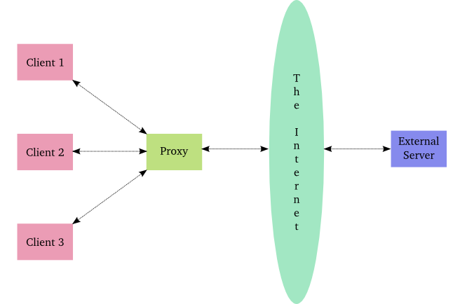
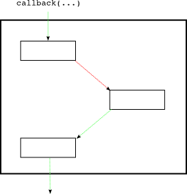
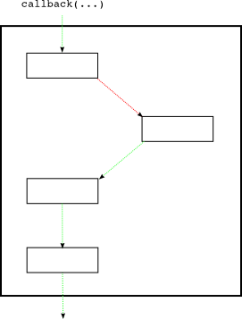

### 介绍

这部分我们要介绍Deferred的另外一个功能。便于讨论，我们设定如下情景：假设由于众多的内部网请求一个外部诗歌下载服务器，但由于这个外部下载服务器性能太差或请求负荷太重。因此，我们不想将所有的内部请求全部发送到外部服务器。

我们的处理办法是，在中间添加一个缓存代理。当一个请求来到后，缓存服务器会从缓存中返回备份（如果有缓存）或者直接从外部服务器获得。部署图如图30所示：

<div style="text-align: center"></div>
<div style="text-align: center">图30 缓存代理服务器</div>

考虑到客户端端发送请求来时，缓存代理可能会将本地缓冲的诗歌取出返回，也有可能需要异步等待外部诗歌下载服务器的回复。如此一来，就会出现这样的情景：客户端发送来的请求，缓存代理处理请求可能是同步也可能是异步。

要解决这个需要，就用到了Deferred的另一个特性：可以在返回Deferred前就激活。之所以可以这样做，是因为你可以在一个已经激活的deferred上添加回调处理函数。一个非常值得注意的是：已经被激活的deferred可以立即激活新添加的回调处理函数。图31表示一个已经激活的deferred：

<div style="text-align: center"></div>
<div style="text-align: center">图31 已经激活的deferred</div>

如果在此时，我们再为其另一对callback/errback，那么会立即激活执行新的回调。如图32

<div style="text-align: center"></div>
<div style="text-align: center">图32 同一个deferred在添加新的回调之后</div>

后面的callback回调被执行，是因为前面的callback执行成功。如果前面执行失败，那么接下来执行的将是新添加的errback回调。

我们可以通过 [twisted-deferred/defer-11.py](http://github.com/jdavisp3/twisted-intro/blob/master/twisted-deferred/defer-11.py) 示例来检测我们这里说到的特性。其中第二组例子，演示了deferred中的pause与unpause函数的功能，即可以暂停一个已经激活的deferred对其回调链上回调的激活。并可以用unpause来解除暂停设置。这两个函数同样完成了在回调中继续产生deferred期间的控制。
我们可以通过 [twisted-deferred/defer-11.py](http://github.com/jdavisp3/twisted-intro/blob/master/twisted-deferred/defer-11.py) 示例来检测我们这里说到的特性。其中第二组例子，演示了deferred中的pause与unpause函数的功能，pause可以暂停一个已经激活的deferred对其回调链上回调的激活，unpause可以解除暂停。这个机制类似于“当Deferred回调链上的回调函数又返回Deferred时，Deferred暂停自己”。

### 代理 1.0版本

让我们来看看第一个版本的缓存代理的实现[twisted-server-1/poetry-proxy.py](http://github.com/jdavisp3/twisted-intro/blob/master/twisted-server-1/poetry-proxy.py)。由于该服务器既作为服务器向客户端请求提供本地缓存的诗歌，同时也要作为向外部诗歌下载服务器提出下载请求的客户端，因此其有两套协议/工厂，一套实现服务器角色，另一套实现客户端角色。

首先我们先来看看ProxyService的实现部分：
```python
class ProxyService(object):
    poem = None # the cached poem
    def __init__(self, host, port):
        self.host = host
        self.port = port
    def get_poem(self):
        if self.poem is not None:
            print 'Using cached poem.'
            return self.poem
        print 'Fetching poem from server.'
        factory = PoetryClientFactory()
        factory.deferred.addCallback(self.set_poem)
        from twisted.internet import reactor
        reactor.connectTCP(self.host, self.port, factory)
        return factory.deferred
    def set_poem(self, poem):
        self.poem = poem
        return poem
```
主要的函数是get_poem。如果缓存中没有请求的诗歌，那么就会建立连接从外部服务器中异步取得而返回一个deferred，并将取得的诗歌放到缓冲区中。相反，若缓冲区中存在请求的诗歌，则直接返回诗歌。

我们如何来处理这样一个返回值不确定的函数呢，让我们来看看实现服务器角色的协议/工厂：
```python
class PoetryProxyProtocol(Protocol):
    def connectionMade(self):
        d = maybeDeferred(self.factory.service.get_poem)
        d.addCallback(self.transport.write)
        d.addBoth(lambda r: self.transport.loseConnection())

class PoetryProxyFactory(ServerFactory):
    protocol = PoetryProxyProtocol
    def __init__(self, service):
        self.service = service
```
这里使用了maybeDeferred函数解决了这个问题。此函数的功能就是如果作为其参数返回值为defer，那么其不作任何处理，原样将defer返回。但如何返回值不是defer而是一个值（正如我们的缓存代理将本地缓冲的诗歌返回一样），那么这个maybeDeferred会将该值重新打包成一个已经激活的deferred返回，注意是已经激活的deferred。当然，如果返回的是一个异常，其也会将其打包成一个已经激活的deferred，只不过就不是通过callback而是errback激活的。

### 运行代理服务器

启动诗歌下载服务器：
```
python twisted-server-1/fastpoetry.py --port 10001 poetry/fascination.txt
```
启动代理服务器：
```
python twisted-server-1/poetry-proxy.py --port 10000 10001
```
代理服务器监听10000端口，连接100001端口下载诗歌。

开一个客户端：
```
python twisted-client-4/get-poetry.py 10000
```
我们使用早期不带诗歌翻译功能的客户端。你可以看到客户端窗口中显示了诗歌内容，代理服务器窗口显示“从下载服务器获取诗歌”。你可以再次启动客户端，代理服务器会从缓存中取得诗歌返回，客户端显示的内容和刚才一样。

### 代理 2.0版本

前面我们已经提到，有另一种替代方法来实现这一机制。这在 [twisted-server-2/poetry-proxy.py](http://github.com/jdavisp3/twisted-intro/blob/master/twisted-server-2/poetry-proxy.py) 中很好的说明了。即我们可以返回一个已经激活的defer，放在这儿就是如果缓存代理中有请求的诗歌，那么就通过返回一个激活的deferred：
```python
def get_poem(self):
    if self.poem is not None:
        print 'Using cached poem.'
        # return an already-fired deferred
        return succeed(self.poem)
    print 'Fetching poem from server.'
    factory = PoetryClientFactory()
    factory.deferred.addCallback(self.set_poem)
    from twisted.internet import reactor
    reactor.connectTCP(self.host, self.port, factory)
    return factory.deferred
```
如果我们去看[defer.succeed](http://twistedmatrix.com/trac/browser/trunk/twisted/internet/defer.py)的源码会发现，其只是在返回一个deferred之前，将其激活。同样，如果想要返回一个以失败的方式激活的deferred，可以调用函数[defer.fail](http://twistedmatrix.com/trac/browser/trunk/twisted/internet/defer.py)

在这个版本中，由于get_poem返回的是deferred而不像前一个版本存在不确定性因素。因此协议实现就无需使用maybeDeferred(当然也可以使用)：
```python
class PoetryProxyProtocol(Protocol):
    def connectionMade(self):
        d = self.factory.service.get_poem()
        d.addCallback(self.transport.write)
        d.addBoth(lambda r: self.transport.loseConnection())
```
除了这两个地方，其他地方都是相同的，你可以使用上面的方法运行测试，结果是一样的。

### 总结

这个部分我们学习到了deferred可以在返回之前被激活，这样我们就可以将其用于同步环境中。并且我们已经知道了有两种方法来实现：

1. 当一个函数有时返回Deferred，有时返回一个普通的值，可以使用maybeDeferred函数
2. 使用succeed/fail来返回已经激活的Deferred， 包装“半同步”方法。

两者返回的都是deferred, 选择使用哪一种主要看你自己。前面事实已经证明，我们的函数并不是一直都是异步。如何选择并没有一个事实上的标准。

Deferred可以在激活后添加新的回调也间接说明了我们在第九部分[twisted-deferred/defer-unhandled.py](http://github.com/jdavisp3/twisted-intro/blob/master/twisted-deferred/defer-unhandled.py)(提到的，deferred中会在最后一个回调中遇到未处理异常，并在此deferred被垃圾回收（即其已经没有任何外界引用）时才将该异常的情况打印出来。即deferred回在其销毁前一直持有异常，等待可能还会添加进来的回调来处理。

我们已经将deferred中的大部分功能都介绍完了，当然Twisted开发人员可能不会增强deferred的功能。我们下一部分将讲讲Twisted的其它内容。

### 参考

本部分原作参见: dave @ <http://krondo.com/?p=2205>

本部分翻译内容参见杨晓伟的博客 <http://blog.sina.com.cn/s/blog_704b6af70100qcte.html>
