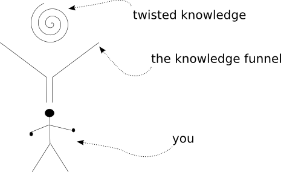

### 完结

呼呼！ 感谢你一路支持. 在我开始时完全没有想到这个系列会这么长,会花这么多时间完成,但是创建这个系列的过程使我非常享受,也希望你喜欢它.

既然我已经完成了,我会进一步考虑将其转化为PDF格式.但是,不保证.

最后,我想总结一些帮助你继续学习Twisted的建议.

### 进一步阅读

首先,我建议阅读Twisted的 [在线文档](http://twistedmatrix.com/trac/wiki/Documentation). 虽然它备受指责,但我觉得这总比饱受赞誉要好.

如果你希望使用Twisted进行网络编程, 那么 **Jean-Paul Calderone** 的广受关注的系列 [Twisted网络编程60秒](http://jcalderone.livejournal.com/50562.html) 是不错的选择. 虽然我觉得60秒可能读不完.

但我认为比以上更重要的是阅读Twisted [源码](http://twistedmatrix.com/trac/browser/trunk), 因为这些源码是被非常熟悉Twisted的人写的,其中的任何例子都会告诉你怎样用"Twisted的方式"做事情.

### 参考练习

1. 将你写过的一个同步程序转化为使用Twisted的.
2. 从零开始,写一个Twisted程序.
3. 从Twisted的 [bug库](http://twistedmatrix.com/trac/report) 拾起一个错误,并修改它. 给Twisted的开发者提交一个补丁, 不要忘记阅读贡献源代码的 [操作流程](http://twistedmatrix.com/trac/wiki/ContributingToTwistedLabs).

### 真的要结束了

祝你编码快乐!

图47 结束

### 参考

本部分原作参见: dave @ <http://krondo.com/blog/?p=2874>

本部分翻译内容参见luocheng @ <https://github.com/luocheng/twisted-intro-cn/blob/master/p22.rst>
